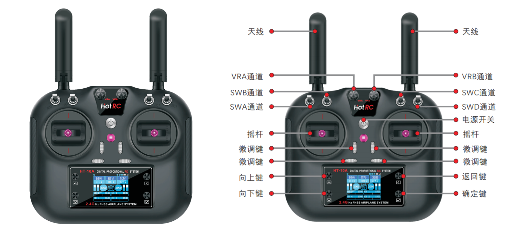
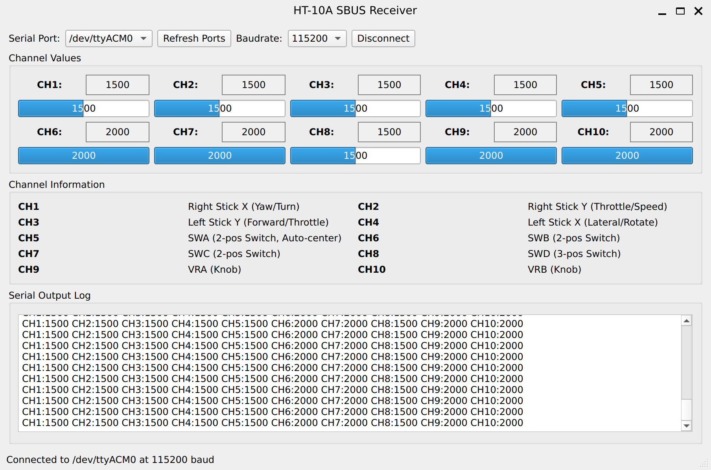

# ht10a-sbus-bridge

基于 **ESP32-C3** 的 **HT-10A 航模遥控器 SBUS 接收机解析器**，  
将 SBUS 信号解析为通道数据，并通过 **UART 串口输出**，方便上位机（PC / ROS / ROS 2）使用。

本项目适用于 **ROS 机器人 / ROS 小车 / 嵌入式机器人平台**，  解决 **SBUS 接收机无法直接接入 PC** 的问题。
HT-10A 遥控器如下图所示：



---

## 系统架构

```
HT-10A 遥控器
        ↓
SBUS 接收机
        ↓  (SBUS)
ESP32-C3
        ↓  (UART / USB)
PC / ROS / ROS 2
```

---

## HT-10A 通道说明（默认无通道映射）

> HT-10A 遥控器 **默认不进行通道映射**，SBUS 输出通道顺序如下：

| 通道 | 输入来源 | 说明 |
|----|----|----|
| CH1 | 右摇杆 左右 | 横向控制（Yaw / Turn） |
| CH2 | 右摇杆 上下 | 前后控制（Throttle / Speed） |
| CH3 | 左摇杆 上下 | 前后 / 升降（视应用） |
| CH4 | 左摇杆 左右 | 横向 / 旋转（视应用） |
| CH5 | SWA | 二档开关（自动回中） |
| CH6 | SWB | 二档开关 |
| CH7 | SWC | 二档开关 |
| CH8 | SWD | 三档开关 |
| CH9 | VRA | 旋钮 |
| CH10 | VRB | 旋钮 |

> 具体语义由**上位系统（ROS）自行映射**

---

##  硬件连接

| SBUS 接收机 | ESP32-C3 |
|----|----|
| SBUS 信号 | GPIO（9） |
| GND | GND |
| VCC | 5V  |

---

## 串口输出格式（示例）

> 默认以 **一行一帧** 输出 10 个通道值（范围通常为 172~1811）

```
CH1:1500 CH2:1500 CH3:1500 CH4:1500 CH5:1500 CH6:2000 CH7:2000 CH8:1500 CH9:2000 CH10:2000
CH1:1500 CH2:1500 CH3:1500 CH4:1500 CH5:1500 CH6:2000 CH7:2000 CH8:1500 CH9:2000 CH10:2000
CH1:1500 CH2:1500 CH3:1500 CH4:1500 CH5:1500 CH6:2000 CH7:2000 CH8:1500 CH9:2000 CH10:2000
CH1:1500 CH2:1500 CH3:1500 CH4:1500 CH5:1500 CH6:2000 CH7:2000 CH8:1500 CH9:2000 CH10:2000
CH1:1500 CH2:1500 CH3:1500 CH4:1500 CH5:1500 CH6:2000 CH7:2000 CH8:1500 CH9:2000 CH10:2000
CH1:1500 CH2:1500 CH3:1500 CH4:1500 CH5:1500 CH6:2000 CH7:2000 CH8:1500 CH9:2000 CH10:2000
CH1:1500 CH2:1500 CH3:1500 CH4:1500 CH5:1500 CH6:2000 CH7:2000 CH8:1500 CH9:2000 CH10:2000
CH1:1500 CH2:1500 CH3:1500 CH4:1500 CH5:1500 CH6:2000 CH7:2000 CH8:1500 CH9:2000 CH10:2000
CH1:1500 CH2:1500 CH3:1500 CH4:1500 CH5:1500 CH6:2000 CH7:2000 CH8:1500 CH9:2000 CH10:2000
CH1:1500 CH2:1500 CH3:1500 CH4:1500 CH5:1500 CH6:2000 CH7:2000 CH8:1500 CH9:2000 CH10:2000
CH1:1500 CH2:1500 CH3:1500 CH4:1500 CH5:1500 CH6:2000 CH7:2000 CH8:1500 CH9:2000 CH10:2000
CH1:1500 CH2:1500 CH3:1500 CH4:1500 CH5:1500 CH6:2000 CH7:2000 CH8:1500 CH9:2000 CH10:2000
```
---

## 上位机软件
PC 端串口接收器软件，基于 PySide6 开发，支持 Windows / Linux 系统。

```
python sbus_receiver.py
```
使用图形界面串口接收软件说明

- 连接 ESP32-C3 到 PC
- 在软件中选择正确的串口
- 点击 "Connect" 连接设备
- 操作遥控器，观察通道值变化

如下图:




